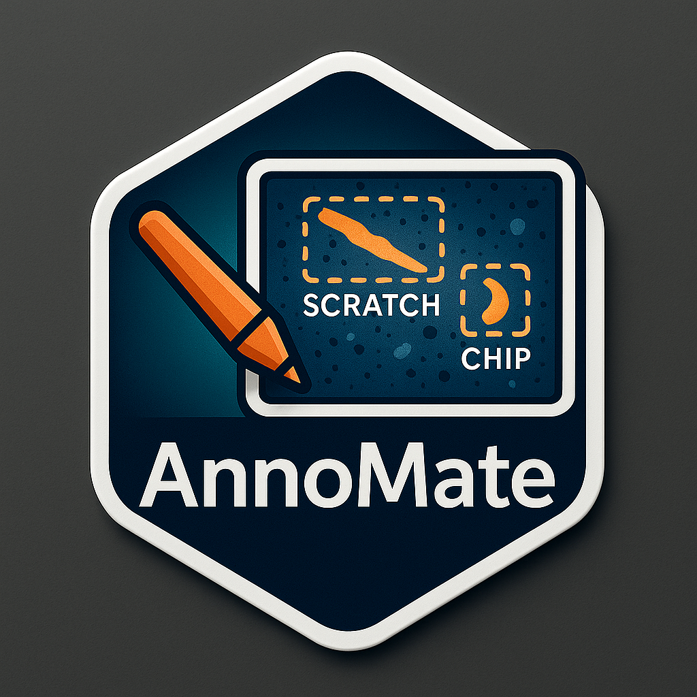

# AnnoMate with MicroSentryAI

<p float="left">
  
  
</p>

AnnoMate with MicroSentryAI is a desktop image-annotation and defect-detection tool designed to streamline quality assurance for manufactured parts. With features such as polygon mask creation, label export to standard annotation formats, and real-time image previews with overlaid masks, AnnoMate simplifies and accelerates the assessment process during production. Its integrated AI/ML capabilities support inspectors by highlighting potential defects and identifying components that may appear incorrect or out of specification. This assistance enhances decision-making and improves consistency in part evaluations.

## Installation

You can install AnnoMate with MicroSentryAI using either pip or conda. Installing AnnoMate with MicroSentryAI in a clean environment with Python 3.12 may be necessary. (Some AnnoMate with MicroSentryAI dependencies currently do not support Python>=3.13)

### pip
```
pip install -r requirements.txt
```

### conda
```
conda env create -f environment.yml
```


## Usage

To help users begin working with AnnoMate and MicroSentryAI, we have developed a comprehensive Getting Started guide that walks through an example workflow illustrating how an inspector would use the tool in practice. For a deeper exploration of the platform, the AnnoMate Guide provides an in-depth look at its full set of features and capabilities. Likewise, the MicroSentryAI Guide explains how the AI engine functions and outlines how users can integrate their own custom AI/ML models into the tool.

Users may replace the provided sample datasets with their own; however, the included examples are available to demonstrate expected behavior and to help verify that the tool is operating correctly.

Documentation for using AnnoMate with MicroSentryAI is provided below:

[Getting Started](./docs/GettingStarted.md)

[AnnoMate Guide](./docs/AnnoMate.md)

[MicroSentryAI Guide](./docs/MicroSentryAI.md)


## Initial Development Team

This tool was developed through a collaborative partnership between **Los Alamos National Laboratory (LANL)** and **Coastal Carolina University (CCU)**.  
The collaboration brings together cutting-edge national laboratory research and innovative academic development to create practical solutions for real-world manufacturing inspection challenges.

[Learn more about the CCU–LANL collaboration](https://www.coastal.edu/computing/lanl-ccucollaboration/).

This project was created and maintained by the following contributors:

**CJ George**  
  [LinkedIn](https://www.linkedin.com/in/cjgeo/) • [GitHub](https://github.com/cjgeo22)

**Mike Szklarzewski**  
  [LinkedIn](https://www.linkedin.com/in/mszklarz/) • [GitHub](https://github.com/MikeSzklarz)

**Gavin Smithson**  
  [LinkedIn](https://www.linkedin.com/in/gavinsmithson) • [GitHub](https://github.com/Gavin-Smithson)

We gratefully acknowledge the support and partnership of both institutions in enabling the development of this tool.

## Notice of Copyright Assertion (O5049)

This program is Open-Source under the BSD-3 License.

Redistribution and use in source and binary forms, with or without modification, are permitted provided that the following conditions are met:

- Redistributions of source code must retain the above copyright notice, this list of conditions and the following disclaimer.

- Redistributions in binary form must reproduce the above copyright notice, this list of conditions and the following disclaimer in the documentation and/or other materials provided with the distribution.

- Neither the name of the copyright holder nor the names of its contributors may be used to endorse or promote products derived from this software without specific prior written permission.

THIS SOFTWARE IS PROVIDED BY THE COPYRIGHT HOLDERS AND CONTRIBUTORS "AS IS" AND ANY EXPRESS OR IMPLIED WARRANTIES, INCLUDING, BUT NOT LIMITED TO, THE IMPLIED WARRANTIES OF MERCHANTABILITY AND FITNESS FOR A PARTICULAR PURPOSE ARE DISCLAIMED. IN NO EVENT SHALL THE COPYRIGHT HOLDER OR CONTRIBUTORS BE LIABLE FOR ANY DIRECT, INDIRECT, INCIDENTAL, SPECIAL, EXEMPLARY, OR CONSEQUENTIAL DAMAGES (INCLUDING, BUT NOT LIMITED TO, PROCUREMENT OF SUBSTITUTE GOODS OR SERVICES; LOSS OF USE, DATA, OR PROFITS; OR BUSINESS INTERRUPTION) HOWEVER CAUSED AND ON ANY THEORY OF LIABILITY, WHETHER IN CONTRACT, STRICT LIABILITY, OR TORT (INCLUDING NEGLIGENCE OR OTHERWISE) ARISING IN ANY WAY OUT OF THE USE OF THIS SOFTWARE, EVEN IF ADVISED OF THE POSSIBILITY OF SUCH DAMAGE.