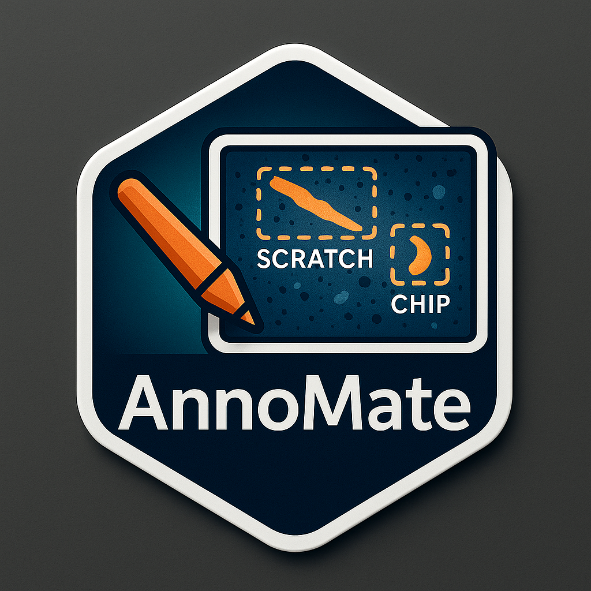

# AnnoMate with MicroSentryAI

  
  

AnnoMate with MicroSentryAI is a desktop image-annotation and defect-detection tool designed to streamline quality assurance for manufactured parts. 

With features such as interactive SAM 2 masking, polygon creation, and standard annotation format exporting, AnnoMate simplifies the assessment process. Its integrated MicroSentryAI engine supports inspectors by highlighting potential defects using custom PyTorch models, enhancing decision-making and improving consistency in part evaluations.

## Documentation

Please refer to the following guides to get started and master the suite:

1. **[Getting Started](./docs/GettingStarted.md):** Installation, environment setup, and basic project management.
2. **[AnnoMate Guide](./docs/AnnoMate.md):** Manual annotation, SAM 2 interactive masking, dataset navigation, and exporting data.
3. **[MicroSentryAI Guide](./docs/MicroSentryAI.md):** Loading custom AI models, batch inference, and utilizing defect heatmaps.
4. **[Validation Guide](./docs/Validation.md):** Scientifically evaluating your AI model's accuracy against human ground-truth data.

## Key Features
* **Interactive AI Masking:** Use Meta's *Segment Anything 2 (SAM 2)* to instantly generate precise defect polygons using simple bounding boxes.
* **MicroSentryAI Inference Engine:** Load your own custom PyTorch models (via Anomalib) to project defect heatmaps and AI-generated outlines directly onto your dataset.
* **Robust Project System:** Save your progress, classes, and loaded models into a single `.annoproj` file with automatic backups.
* **Scientific Validation:** A built-in module to compare AI predictions against human Ground Truth masks to calculate IoU, Precision, and Recall.
* **Standardized Exporting:** Export datasets as COCO JSON, binary masks for AI training, or CSV reports for QA tracking.

## Initial Development Team

This tool was developed through a collaborative partnership between **Los Alamos National Laboratory (LANL)** and **Coastal Carolina University (CCU)**.  
The collaboration brings together cutting-edge national laboratory research and innovative academic development to create practical solutions for real-world manufacturing inspection challenges.

[Learn more about the CCU–LANL collaboration](https://www.coastal.edu/computing/lanl-ccucollaboration/).

This project was created and maintained by the following contributors:

**CJ George**  
  [LinkedIn](https://www.linkedin.com/in/cjgeo/) • [GitHub](https://github.com/cjgeo22)

**Mike Szklarzewski**  
  [LinkedIn](https://www.linkedin.com/in/mszklarz/) • [GitHub](https://github.com/MikeSzklarz)

**Gavin Smithson**  
  [LinkedIn](https://www.linkedin.com/in/gavinsmithson) • [GitHub](https://github.com/Gavin-Smithson)

We gratefully acknowledge the support and partnership of both institutions in enabling the development of this tool.

## Notice of Copyright Assertion (O5049)

This program is Open-Source under the BSD-3 License.

Redistribution and use in source and binary forms, with or without modification, are permitted provided that the following conditions are met:

- Redistributions of source code must retain the above copyright notice, this list of conditions and the following disclaimer.

- Redistributions in binary form must reproduce the above copyright notice, this list of conditions and the following disclaimer in the documentation and/or other materials provided with the distribution.

- Neither the name of the copyright holder nor the names of its contributors may be used to endorse or promote products derived from this software without specific prior written permission.

THIS SOFTWARE IS PROVIDED BY THE COPYRIGHT HOLDERS AND CONTRIBUTORS "AS IS" AND ANY EXPRESS OR IMPLIED WARRANTIES, INCLUDING, BUT NOT LIMITED TO, THE IMPLIED WARRANTIES OF MERCHANTABILITY AND FITNESS FOR A PARTICULAR PURPOSE ARE DISCLAIMED. IN NO EVENT SHALL THE COPYRIGHT HOLDER OR CONTRIBUTORS BE LIABLE FOR ANY DIRECT, INDIRECT, INCIDENTAL, SPECIAL, EXEMPLARY, OR CONSEQUENTIAL DAMAGES (INCLUDING, BUT NOT LIMITED TO, PROCUREMENT OF SUBSTITUTE GOODS OR SERVICES; LOSS OF USE, DATA, OR PROFITS; OR BUSINESS INTERRUPTION) HOWEVER CAUSED AND ON ANY THEORY OF LIABILITY, WHETHER IN CONTRACT, STRICT LIABILITY, OR TORT (INCLUDING NEGLIGENCE OR OTHERWISE) ARISING IN ANY WAY OUT OF THE USE OF THIS SOFTWARE, EVEN IF ADVISED OF THE POSSIBILITY OF SUCH DAMAGE.